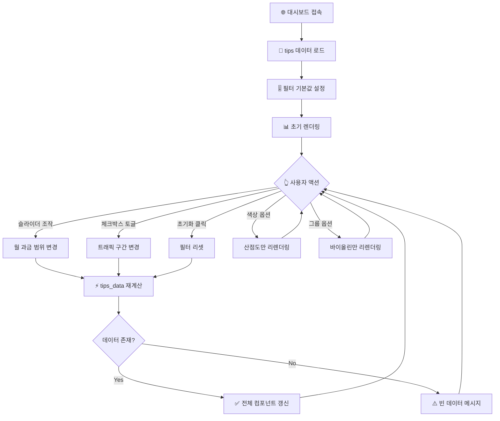
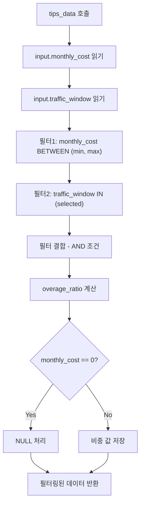
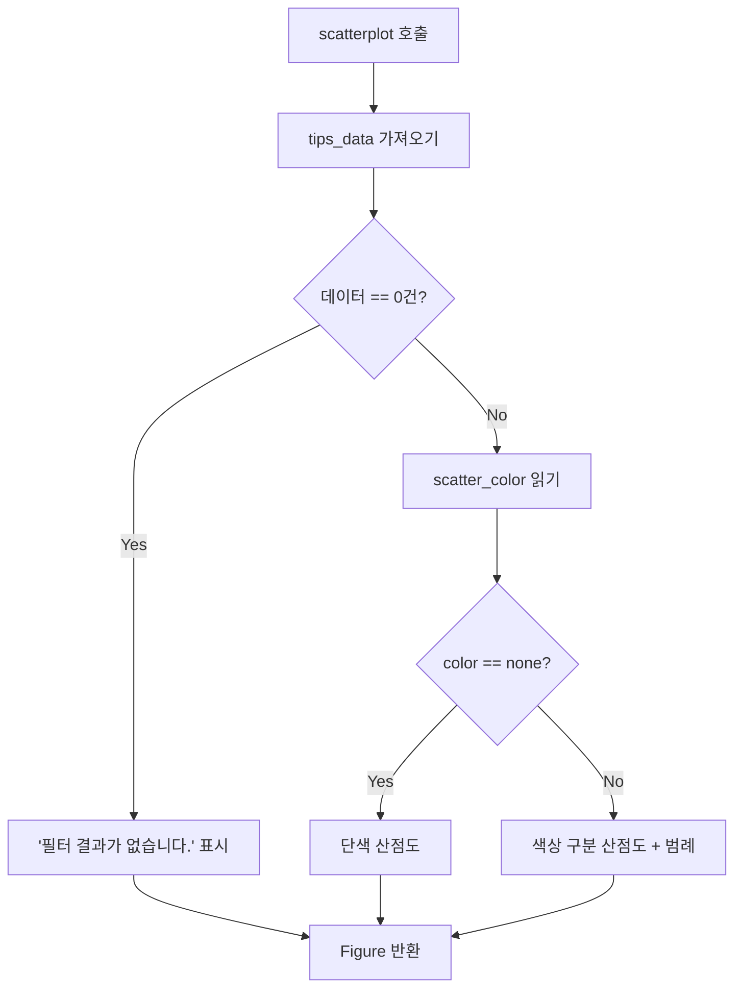
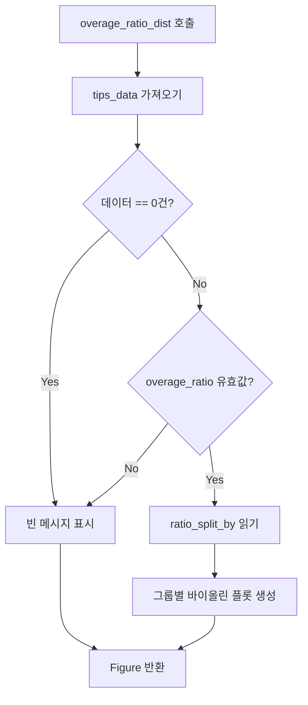
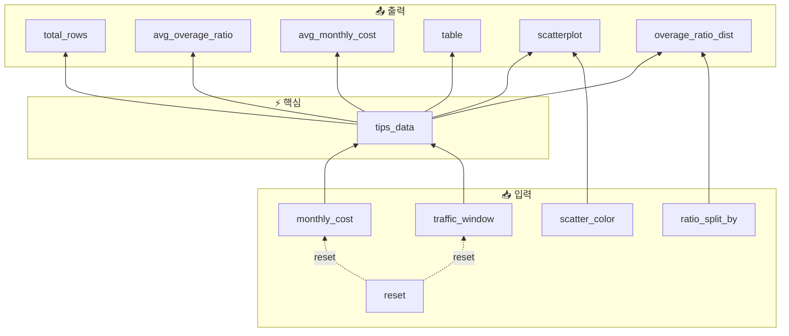
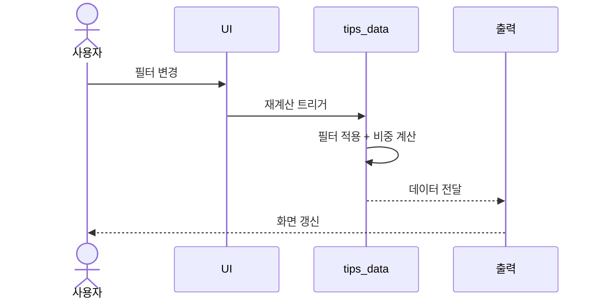

# 플로우차트(Flowchart)

## 1. 문서 개요

| 항목 | 내용 |
| --- | --- |
| **프로젝트명** | 가비아 클라우드 서비스 지표 대시보드 |
| **작성자** | Ted(신태선) - 클라우드기획팀 |
| **작성일** | 2026-01-14 |
| **버전** | v1.0 |

---

## 2. 메인 플로우 (Mermaid)

---

## 3. 데이터 처리 플로우 (tips_data 함수)

---

## 4. 산점도 렌더링 플로우

---

## 5. 바이올린 플롯 렌더링 플로우

---

## 6. 컴포넌트 의존성

---

## 7. 시퀀스 다이어그램

---

## 8. 이벤트-액션 매핑

| 이벤트 | 트리거 | 영향 범위 |
| --- | --- | --- |
| 슬라이더 변경 | `input.monthly_cost` | 전체 (Value Box 3 + 차트 3) |
| 체크박스 변경 | `input.traffic_window` | 전체 (Value Box 3 + 차트 3) |
| 초기화 클릭 | `input.reset` | 필터 → 전체 |
| 산점도 색상 변경 | `input.scatter_color` | 산점도만 |
| 바이올린 그룹 변경 | `input.ratio_split_by` | 바이올린만 |

---

## 9. 변경 이력

| 버전 | 일자 | 작성자 | 변경 내용 |
| --- | --- | --- | --- |
| v1.0 | 2026-01-14 | Ted(신태선) | 최초 작성 |

---