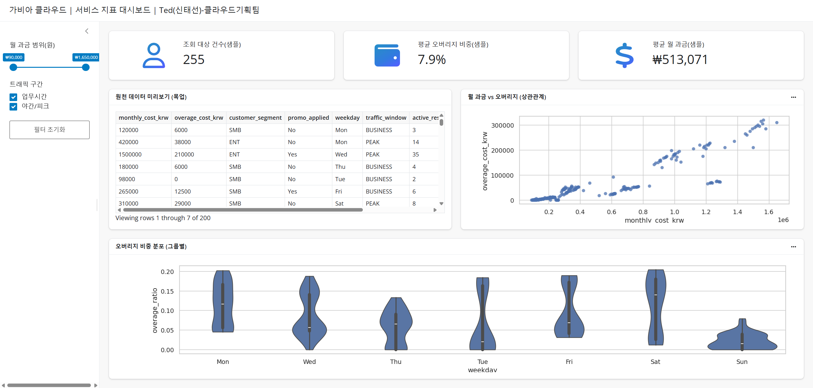

# 화면 설계서(UI Design Specification)

---

## 1. 문서 정보

| 항목 | 내용 |
| --- | --- |
| **프로젝트명** | 가비아 클라우드 서비스 지표 대시보드 |
| **문서 버전** | v1.0 |
| **작성자** | Ted(신태선) |
| **작성일** | 2026-01-14 |
| **최종 수정일** | 2026-01-14 |
| **상태** | 🟢 완료 |

---

## 2. 디자인 링크

| 구분 | 링크 |
| --- | --- |
| **Figma** | [여기에 피그마 링크 삽입] |
| **프로토타입** | - |

---

## 3. 화면 구성 요약

| 영역 | 구성 요소 |
| --- | --- |
| **헤더** | 타이틀 (프로젝트명 + 작성자) |
| **사이드바** | 슬라이더 필터, 체크박스 필터, 초기화 버튼 |
| **상단** | KPI 카드 3개 (건수, 비중, 금액) |
| **중단** | 데이터 테이블 + 산점도 차트 |
| **하단** | 바이올린 플롯 |

---

## 4. 디자인 시스템

### 4.1 색상

| 용도 | 색상 코드 | 미리보기 |
| --- | --- | --- |
| Primary | `#0D6EFD` | 🔵 |
| Background | `#FFFFFF` | ⬜ |
| Card BG | `#F8F9FA` | 🔲 |
| Text Dark | `#212529` | ⬛ |
| Text Muted | `#6C757D` | 🔘 |
| Border | `#DEE2E6` | ▫️ |

### 4.2 타이포그래피

| 용도 | 폰트 | 크기 | 굵기 |
| --- | --- | --- | --- |
| 페이지 타이틀 | Pretendard | 16px | Semi-bold |
| 카드 타이틀 | Pretendard | 14px | Semi-bold |
| KPI 값 | Pretendard | 28px | Bold |
| 본문 | Pretendard | 14px | Regular |
| 캡션 | Pretendard | 12px | Regular |

### 4.3 간격

| 구분 | 값 |
| --- | --- |
| 카드 패딩 | 20px |
| 섹션 간격 | 24px |
| 카드 간격 | 16px |
| 사이드바 너비 | 280px |

---

## 5. 컴포넌트 목록

| # | 컴포넌트 | 타입 | 상태 |
| --- | --- | --- | --- |
| 1 | 레인지 슬라이더 | Input | 기본/드래그 |
| 2 | 체크박스 | Input | 체크/미체크 |
| 3 | 버튼 (Primary) | Button | 기본/호버 |
| 4 | Value Box 카드 | Card | - |
| 5 | 데이터 테이블 | Table | - |
| 6 | 산점도 차트 | Chart | - |
| 7 | 바이올린 플롯 | Chart | - |

---

## 6. 반응형 정의

| 디바이스 | 너비 | 사이드바 |
| --- | --- | --- |
| Desktop | 1440px+ | 표시 |
| Tablet | 768px~1439px | 접힘 |
| Mobile | ~767px | 숨김 |

---

## 7. 변경 이력

| 버전 | 일자 | 작성자 | 변경 내용 |
| --- | --- | --- | --- |
| v1.0 | 2026-01-14 | Ted(신태선) | 최초 작성 |

---

## 8. 산출물

[Cloud Service Analytics Dashboard](https://leaves-glory-09383861.figma.site/)

[Cloud Service Analytics Dashboard](https://www.figma.com/make/4kTN4jcBbLQkoHui8AnFTG/Cloud-Service-Analytics-Dashboard?t=04q38gDeD85bCnP1-1)

